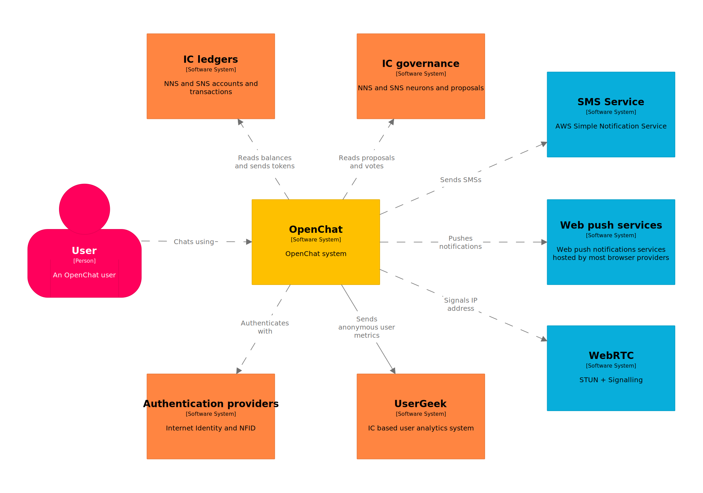
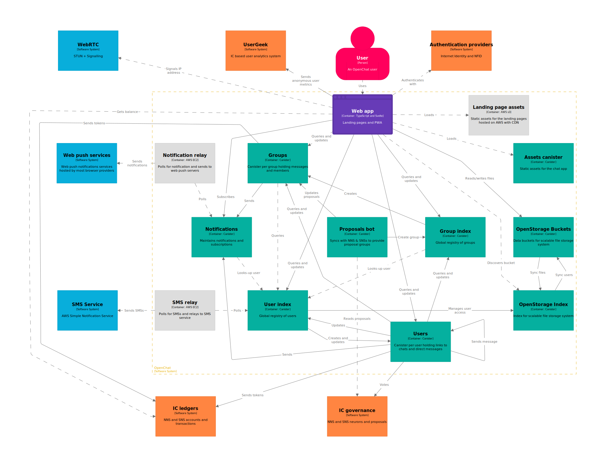
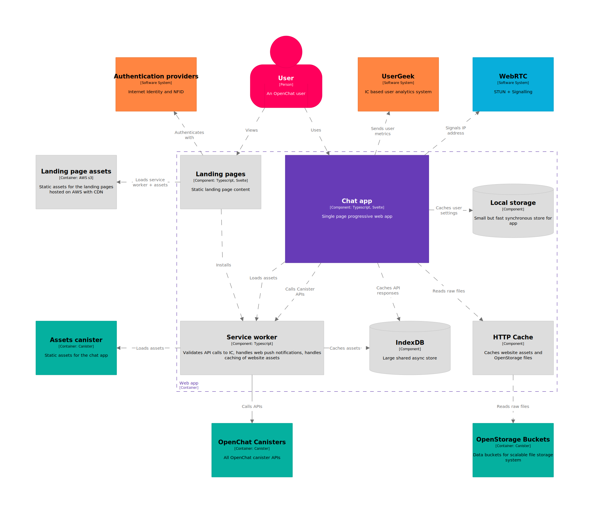
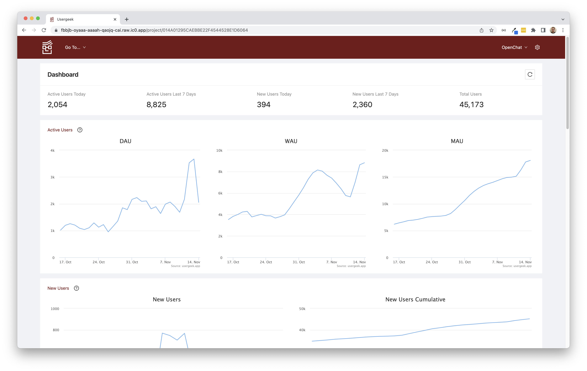

# OpenChat Architecture

## Overview {#1}

OpenChat is a system composed of canister smart contracts running on the Internet Computer which provides chat functionality. The canisters provide an API and serve the assets for the OpenChat web app, and going forwards, will allow 3rd-party services to integrate chat.

This diagram shows the OpenChat system in yellow with its various external dependencies. The orange boxes are services running on the Internet Computer and the blue boxes are off-chain.

## OpenChat system {#2}

This diagram shows the OpenChat system enclosed in the box with the dashed orange border, decomposed into the various deployable units. The solid links represent Internet Computer _updates_ which go through blockchain consensus. The green boxes are all canisters and the light gray boxes are services hosted on AWS.

### Design considerations {#2-1}

The choice of platform and architecture has been driven by a list of requirements

- Open - accessible globally, open source, free to use, transparently operated and governed
- Decentralized - trustless, tamper proof, unstoppable, secure
- Performance comparable to web2
- Easy to build, maintain and operate, with one shared front-end codebase regardless of device
- Affordable to host and run
- Trustworthy tokenization to reward users and drive growth
- Possible to raise funds for development
- Send and receive messages in direct chats and public/private group chats
- Messages securely accessible from any device
- Messages can include file data like images/audio/video/documents
- Optional notifications when new messages arrive
- Send crypto tokens like ICP/CHAT/BTC as chat messages
- Send and receive messages instantaneously with other online users
- Messages are editable and deletable
- Supports secure end-to-end encryption of messages
- Prevent automatic creation of fake accounts
- Identify whether a user account is owned by a unique person
- Can scale to all people in the world

… and by the characteristics of canisters

- Canisters are hosted within subnets typically composed of 13 powerful node machines each in an independent data center in a different location around the globe.
- Each canister is replicated across all nodes in the subnet.
- Update calls can update persistent state and go through consensus which takes roughly 2 seconds.
- Query calls can be answered immediately by any replica but cannot update state. Queries take milliseconds and are highly scalable due to load balancing across 13 nodes.
- Canisters use the actor model so each call is handled by a single thread.
- Canisters hold their own state (orthogonal persistence) directly in memory. WASMs are limited to 4GB but soon canisters will each be able to use up to 32 GB of _stable_ memory.
- Canisters support _heartbeat_ functionality (and soon _timers_) allowing them to perform background tasks.
- Canisters can make outbound HTTPS calls (by all replicas simultaneously) and the response goes through consensus. In the future they will be able to make fire-and-forget HTTP calls from 1 replica where the response can be ignored making it suitable for logging or metrics or sending notifications.
- Inter-canister update calls can be made securely between subnets and in the future inter-canister query calls (ICQC) between subnets will be supported. ICQCs within the same subnet are quick because they can be handled without leaving the original node due to each node having an instance of each canister.

As early adopters we were fortunate to be given a dedicated subnet which was whitelisted for inter-canister query calls (ICQC) and this has factored into the design of the system. Various metrics and information on the OpenChat subnet are available publicly on the [IC dashboard](https://dashboard.internetcomputer.org/subnet/eq6en-6jqla-fbu5s-daskr-h6hx2-376n5-iqabl-qgrng-gfqmv-n3yjr-mqe).

### Verifiable source code {#2-2}

The OpenChat source code is available on [github](https://github.com/open-chat-labs/open-chat) under the [GNU Affero General Public License](https://en.wikipedia.org/wiki/GNU_Affero_General_Public_License) which is approved by the Open Source Initiative as an "open source license". Essentially this license allows the source code to be copied and modified but only if the modified code is also available under the same license.

All of our canisters use the Rust language and CDK. The source code is built into the WASMs used by each type of OpenChat canister in a repeatable way using docker. Anyone who pulls the OpenChat source code and uses the docker build will produce identical WASM files.

Each canister exposes a metrics endpoint which is publicly accessible over the raw domain. In each case these metrics include the _git commit id_ which identifies the specific source code revision used to build the WASM currently running on that canister. For example here is the url of the metrics endpoint for the user index canister:
https://4bkt6-4aaaa-aaaaf-aaaiq-cai.raw.ic0.app/metrics

You can use _dfx_ to interrogate the sha256 hash of the WASM module for any given canister id using the following command:

    dfx canister --network ic info 4bkt6-4aaaa-aaaaf-aaaiq-cai

By building the WASM module for a canister at the given git commit, calculating its sha256 hash, and comparing with the module hash returned by the IC using _dfx_, the source code running on any canister can be verified.

- the canister ids of the top-level OpenChat canisters can be found in the canister_ids.json file in the root of the OpenChat repo
- the canister id of any group canister can be found in the url for that group in the OpenChat app
- likewise the canister id of any user canister can be found in the url of a direct chat with that user
- your own canister id can be found from the main menu in the advanced section of your profile

### Deployment / upgrade {#2-3}

User and group canisters are upgraded in batches with an API call to their respective index canisters which can only be called by dev team member principals and going forward, only by the SNS.

### APIs {#2-4}

The client-facing APIs all use candid which is the standard for the Internet Computer. The internal canister-to-canister APIs use [MessagePack](https://msgpack.org/index.html) which is efficient and flexible allowing them to evolve easily by keeping backward compatibility.

Every OpenChat canister exposes a public [metrics endpoint](https://4bkt6-4aaaa-aaaaf-aaaiq-cai.raw.ic0.app/metrics) which includes some common data (below) and also data specific to the type of canister.

- memory used
- time now (in milliseconds since unix epoch)
- cycles balance
- wasm version
- git commit id

Also every OpenChat canister exposes a public [logs endpoint](https://4bkt6-4aaaa-aaaaf-aaaiq-cai.raw.ic0.app/logs).

### User canisters {#2-5}

#### Overview {#2-5-1}

A key decision was made to give each user their own canister. This holds the user’s direct chats including the messages of both parties, references to each group the user is a member of, and other data such as their authentication principal, username, bio, avatar and blocked users. The user’s canister becomes a wallet for holding tokens in IC ledgers which allows tokens to be sent between users as chat messages. The user can also add their canister as a hotkey to their neurons which allows them to easily vote on proposals within the NNS and SNS proposal groups on OpenChat.

The simplest design of having all users in a single canister doesn’t scale much beyond 100,000 users, so an alternative might be to shard users into buckets. However this is much more complicated to implement. In the case of a single canister per user, access control is straightforward because only the user can access their own canister. Whereas if many users share a canister the access control must be much more fine-grained and it is harder to keep user data secure. Eventually a given user bucket would need to split which would get messy and complicated to handle.

##### Pros {#2-5-1-1}

- Natural scalability (of data and processing)
- Simple implementation
- Secure
- Canister as wallet
- Each user has a well known, permanent address
-

##### Cons {#2-5-1-2}

- Doesn’t scale so well right now because the IC has not yet been optimized to run 100,000s of canisters on the same subnet - for instance if 100,000 canisters have the same WASM then the WASM is stored 100,000 times whereas it should only need to be stored once. This is on the [Internet Computer roadmap](https://internetcomputer.org/roadmap/) in the In-Progress section of the Core Protocol category. Even so there will be a limit to how many canisters can be run on a single subnet and at some point OpenChat will need to span [multiple subnets](#4-6).
- More expensive per user because (currently) each canister needs a minimum buffer of cycles and upgrading is more expensive.
- Upgrading many user canisters is slow

To help get an understanding of how the user canister fits into the overall architecture it is worth considering a few use cases. In each case the user must be authenticated so that API calls are made with their principal otherwise they will be rejected.

#### Send direct message {#2-5-2}

1. If the message contains a file attachment such as an image or video then the app uploads the file to OpenStorage.
2. A call is made to send_message on the user canister with the message details.
3. The message is validated.
4. If the message is a token transfer a call is made to the relevant ledger canister to transfer the tokens between user accounts.
5. The message is stored in the senders canister.
6. The message is sent to the recipient’s user canister with a call to the c2c_send_message endpoint.
   1. The message is stored in the recipient's canister.
   2. If the recipient has not muted the chat a notification is sent to the notifications canister.

For the sake of performance the _send_message_ call does not wait for the response from the recipient’s canister but returns immediately and if it fails the message is queued and re-sent later using a _timer_.

#### Set user avatar {#2-5-3}

A call is made to _set_avatar_ on the user canister with the metadata and image bytes, and is stored. Then a fire-and-forget call is made to _c2c_set_avatar_ on the _user index_ canister to update the user record with the avatar id so that other users can discover the user’s new avatar.

#### Create group {#2-5-4}

A call is made to _create_group_ on the _user_ canister with the group details. It validates the details and confirms the user hasn’t already created their allowance of groups. The _user_ canister then calls _c2c_create_group_ on the _group index_. This in turn queries the _user index_ for the user’s principal and uses this as one of the arguments to create and initialize a new _group_ canister. Once this has all completed the call to create_group returns and the group is ready to go.

#### Search messages across all chats {#2-5-5}

A query call is made to _search_all_messages_ on the _user’s_ canister with the search term and the maximum number _N_ of results to return. The messages of each of the user’s direct chats are searched directly and the matches scored. In parallel query calls are made to _c2c_search_messages_ for each group the user is a member of. Each _group_ canister will search its messages and respond with any matches and their scores. Finally the top _N_ matches across all the chats based on their score are returned.

#### Get chat summary updates {#2-5-6}

The following glosses over some details because the full story is rather complicated, but gives the essential idea. The web app makes a query call to _updates_ on the _user_ canister every 5 seconds to check for any changes to chat summaries that have occurred since the previous call to _updates_. These chat summaries include the latest message and other details which allow the client to show the most recent chat summary in the chat list. They also include the latest message index and event index which allow the client to know what it is missing.

The _updates_ method builds the latest chat summary (or update) for each of the user’s direct chats, and queries _c2c_filter_groups_ on the _group index_ with the ids of each group the user is a member of, getting back the list of _active_ groups. For each active group only, the _user_ canister calls _c2c_summary_ (or _c2c_summary_updates_ if called before) to get the chat summaries (or updates) for the groups.

The notion of _active_ groups allows for this important performance optimization. At any one time only a small number of a user’s groups are likely to be active and so we can avoid querying inactive groups on every _updates_ call. Each group canister will call _c2c_mark_active_ on the _group index_ at most once every 10 minutes in response to any new group messages/events which allows the _group index_ to keep track of each group’s active status.

### User Index canister {#2-6}

The _user index_ canister essentially holds the global registry of OpenChat users. Each user record includes the _principal_, _user id_, _username_, _avatar id_, _created/updated/last online_, _account charges_, _phone verification status_, _storage limit_, _user referred by_, _wasm version_, and several other fields. It is responsible for creating, upgrading, topping up, and keeping track of _user_ canisters. It can verify users (using a code sent over SMS) and take payment for premium services such as more storage or groups. It calls into [OpenStorage](#2-9) to manage users’ file storage quotas.

Ultimately it might be necessary to shard the _user index_ across multiple canisters but 32 GB of stable memory will give enough capacity for a long time yet and we can cross that bridge later.

Following are details of some _user index_ use cases.

#### Register a user {#2-6-1}

To prevent someone from programmatically calling the _register_user_ endpoint to create 1000s of dummy accounts it is protected by a CAPTCHA. First the client calls _create_challenge_ on the _user index_. This generates a _challenge_ image consisting of disguised characters, assigns the challenge a random key, stores the challenge solution + timestamp against the key, and finally returns the key and challenge image. It also removes any existing stored challenge solutions that are more than 5 minutes old.

Subsequently, a call is made to _register_user_ on the _user index_ with the username, challenge attempt, and an optional referrer. Firstly a number of checks are made.

- Is the challenge attempt successful?
- Is there no existing user for the given authenticated principal?
- Is the username valid?
- Is the username available and unreserved?

If all of the checks pass then the username is reserved and a canister is created and then initialized with the reserved username. Because it can take some time to create a canister the _user index_ maintains a pool of uninitialized User canisters that it can immediately use.

#### Verify a phone number {#2-6-2}

A difficult challenge for OpenChat and many other projects is to prevent exploitation by unscrupulous parties. In our case there is an extra cost to us in providing certain features which we therefore consider _premium_.

- Storage for uploading, sending, storing files in messages (images, videos etc)
- The number of groups a user can create
- On demand message translation

Anyone can pay a small charge (0.2 ICP) to become a premium user but we are happy to absorb this cost for any user prepared to verify their _unique personhood_. The method we are employing for now is to send an SMS with a verification code to the phone number the user submits which they must then enter to prove they own the phone. This phone number can’t then be re-used for another user. This works to some degree because it is a hurdle for one person to own lots of phone numbers. This is not an ideal solution for a number of reasons although for now is the best solution we have.

- Not everyone is prepared to submit their phone number even though we only use it for this purpose
- We can’t currently send SMSs to all places in the world
- It is possible to obtain multiple phone numbers and therefore still exploit the system

A call is made to _submit_phone_number_ on the _user index_. If the submitted phone number is valid and has not already been used by another user, then a random verification code is stored against the user’s principal which expires after 10 minutes. The phone number is stored so we can prevent it being reused by another user. Finally, an SMS notification (to the given phone number with the verification code as the message) is queued. The SMS relay oracle will poll the _sms_messages_ query endpoint, send any queued SMSs and then call _remove_sms_messages_ to remove them from the queue.

Subsequently, a call is made to _confirm_phone_number_ on the _user index_ which takes a confirmation code. This code is compared against the code stored in the caller’s user record. This proves whether the user owns (or at least has access to) a phone with the given number. If so then the user record is updated to reflect their premium status and they will now have access to the premium features.

We plan to soon ditch our solution and make use of [NFID’s](#3-1-2) improved phone number verification. The challenge to provide _proof of unique personhood_ is common to many applications and Identity Labs (the team behind NFID) are actively researching it. If and when they come up with a better solution we will adopt it.

#### Change username {#2-6-3}

A call is made to _set_usermame_ on the _user index_. If the username is valid and available then it is updated in the user’s record. A user event is also queued and periodically, using _heartbeat_, user events are synced with _user_ canisters with a call to _c2c_notify_user_events_.

#### Sync users {#2-6-4}

The web app periodically queries the _users_ endpoint on the _user index_ with lists of _user ids_ plus a _last updated_ timestamp. It returns a timestamp to be used for future calls and a _summary_ record for any matching users whose _summaries_ have changed since the passed in timestamp. This enables clients to discover any changes to users such as their username.

### Group canisters {#2-7}

As for users, each group has its own canister. This stores and manages the group members and their roles, all the messages and other events that have occurred in the group, and other details of the group such as _name_, _description_, _rules_, _avatar_, _permissions_, _pinned messages_ etc. Any message file attachments such as images and videos are stored using the OpenStorage service rather than in the group canister itself. We anticipate that with 32 GB of stable storage available to a single canister and since the messages in _group_ canisters only have text, no groups will outgrow their canister. The same goes for _user_ canisters.

Following are details of some _group_ canister use cases.

#### Add members {#2-7-1}

For private groups, if an existing group member has the required permission, they are able to search for users in the app and add them as members to the group. To add users to a group a call is made to _add_particpants_ (name needs changing to members!) on the _group_ canister which takes a list of _user ids_. If the caller is a member with the required permission and the group does not exceed the member limit of 100,000, then each user will be added provided they are not already a member and they have not been explicitly blocked from the group. In parallel, a call is made to _c2c_try_add_to_group_ on each _user_ canister. If the user canister exists and that user hasn’t themselves blocked the calling user, then they are added as a new member of the group.

#### Update group details {#2-7-2}

Group details can be updated by calling _update_group_v2_ on the _group_ canister. Any combination of _name_, _description_, _rules_, _avatar_ and _permissions_ can be updated with this method provided the data is valid and the caller has the permission to update group details.

If the group is public and any one of the _name_, _description_ or _avatar_ has changed then a call is made to _c2c_update_group_ on the _group index_ so that it can efficiently return these group details in response to a public group search or call to get _hot groups_. Once this has succeeded then the group details are updated in the _group_ canister itself.

#### Send message {#2-7-3}

If the message contains a file attachment such as an image or video, then first the app uploads the file to OpenStorage. It then calls _send_message_ on the _group_ canister with the message details. Groups support _threaded_ replies so the message request can optionally specify the id of the _root message_ for a thread. Assuming the caller has the necessary permissions the message is added to the list of events stored in the _group_ canister. For any group members who have notifications enabled a notification is sent to the notifications canister. If a user is @mentioned explicitly in a message then they will be notified regardless of whether they have muted the group. This also applies to the sender of the original message if this is a reply to that message. For messages in a _threaded_ reply only thread participants are notified.

#### Create / vote on polls {#2-7-4}

A group member can create a poll using _send_message_ provided they have the necessary permission. Members can subsequently vote on polls with a call to _register_poll_vote_. Polls typically expire, in which case a task is scheduled, using the _timer_, to add a _poll expired_ event to the event list in the _group_ canister which allows clients to subsequently discover the poll has ended.

#### Get selected group details {#2-7-5}

Clients sync much of the data for a group by polling the [_updates_](#2-5-6) endpoint on the user canister which then fans out to the canisters of the user’s groups. However this isn’t efficient or necessary for some other group data, in particular members, blocked users, pinned messages, and group rules. When a user selects a group chat the app tries to load this data from its store. If it doesn’t have it stored locally it queries _selected_initial_ on the _group_ canister and then puts the result in the store. Otherwise, if the data is already stored, the app queries _selected_updates_ on the _group_ canister which returns only changes to the data since the given timestamp and they are merged back into the client store.

#### Get events / messages {#2-7-6}

There are several query endpoints on _group_ canisters (and likewise for _user_ canisters) which are concerned with loading events, including messages, in different situations.

- _events_by_index_
- _events_window_
- _events_
- _message_by_message_index_

There are many types of group events for example:

- _Message_
- _GroupNameChanged_
- _MemberAdded_
- _MemberJoined_
- _MemberLeft_
- _MessageReactionAdded_
- _PollVoteRegistered_
- _PollEnded_
- _MessageEdited_
- _MessageDeleted_

The app will cache these events locally. Some events _affect_ previously cached events such as _MessageEdited_ or _MessageReactionAdded_. In addition to the requested events themselves the _event_\* endpoints also return a list of events affected by these events. The client app will cache the new events and invalidate the cache for any affected events.

It is possible for lagging replicas to return stale data in query responses. Unless particular care is taken, this can lead to some nasty issues, in particular related to affected events. To prevent these issues all methods which update events take a _correlation id_ and this is returned with every event from all of the above _event_\* methods. If the client has stored events locally then they will not be updated or invalidated by any events from the server unless the _correlation ids_ match.

### Group Index canister {#2-8}

The _group index_ canister essentially holds the global registry of OpenChat groups. Each group record includes the _group id_ (canister id), _active until timestamp_, _wasm version_, and several other fields. In addition, public group records include the _name_, _description_, _avatar id_, and various other fields. It is responsible for creating, upgrading, topping up, and keeping track of _user_ canisters. It also provides a searchable index of _public_ groups and maintains a list of _hot groups_.

There aren’t any specific update methods to be called by clients. Typically updates to the _group index_ state are initiated by other canisters calling into the various _c2c_ endpoints some of which we have already discussed such as _c2c_create_group_ and _c2c_update_group_.

#### Hot groups {#2-8-1}

_Hot groups_ are actually accessed by calling _recommended_groups_ on the user canister which calls _c2c_recommended_groups_ on the _group index_ passing in a list of groups to exclude - either those the user is already a member of or has recently dismissed. A list of public groups is returned, ordered by a score which takes into account recent messages/activity in a group, number of members, and a random factor.

#### Search {#2-8-2}

The _search_ endpoint on the _group index_ takes a _search term_ and _maximum results N_ and returns the ranked top _N group summaries_ of public groups whose _name_ and/or _description_ match the search term.

### OpenStorage canisters {#2-9}

[OpenStorage](https://github.com/open-chat-labs/open-storage) is a scalable file storage system built by the OpenChat team which is available to be used by other projects. It consists of an _index_ canister and dynamically created _bucket_ canisters which hold the file data. Once a bucket is full it becomes read-only and a new bucket is created. OpenStorage implements [_content addressing_](https://en.wikipedia.org/wiki/Content-addressable_storage) so that for duplicate files the data is only stored once. This makes the _forwarding_ of _file_ messages on OpenChat cheap and quick. _Files_ in OpenStorage are _owned_ by users, in the case of OpenChat the sender of a file message is the file owner. Internally a file holds a reference to the underlying _blob_. It uses reference counting so that if all the files for a given blob are deleted then the blob is deleted.

Each user is given a byte allowance which they can’t exceed. The first file reference a user has to a blob comes out of the user’s allowance but any further file references the user has to the same blob do not. This allows a user to upload or forward the same file multiple times without additional cost.

In the case of OpenChat, users are given an allowance of 0.1GB if they either verify the "uniqueness" of their account with an SMS code or if they pay a small charge. They can pay to increase their allowance in 0.1GB increments up to a maximum of 1GB although this is likely to increase in the future. Soon we will support a toggle in OpenChat to automatically delete old image/video data so they can recycle their allowance. The actual _message_ itself would not be deleted and this contains a very low-res thumbnail which would not be deleted and would be shown in place of the full image.

OpenStorage also has the notion of file _accessors_ which are the principals permitted to view any given file (in addition to the file owner). An accessor may also grant read access to other principals so they also become accessors. In OpenChat the _id_ of the chat in which a file message is sent is made the accessor. When a file message is forwarded to another chat the original chat grants access to the file to the new chat.

### Notifications canister {#2-10}

The _notifications_ canister holds a queue of notifications sent from _user_ or _group_ canisters to be sent on to registered users using [_web push notifications_](https://web.dev/push-notifications-overview/). It also holds a set of _web push subscriptions_ for each user.

When the app starts, it checks whether notifications are enabled and if not prompts the user. If the user agrees or has already agreed, the browser looks for an existing subscription for this device on the oc.app domain and if not, generates one. The app then queries _subscription_exists_ on the _notifications_ canister to check whether the subscription has already been stored there against the user and if not the app calls _push_subscription_. Each subscription comprises an endpoint to send the notification to along with a key and some auth material. This endpoint is for a server(s) provided by the company who delivers the particular browser. So for example for Chrome, Google provides these web push servers. These servers are able to push notifications directly to users’ browsers.

The _notification relay_ polls the _notifications_ query endpoint on the _notifications_ canister. If there are any new notifications since the oracle last called these are returned along with the set of subscriptions for each user being notified. It sends these notifications for each user to each of the user’s subscriptions by calling the https endpoint specified in the subscription along with the key and auth material. Finally it calls _remove_notifications_ on the _notifications_ canister to clear them from the queue.

If a user disables notifications on a particular device then the app will call _remove_subscription_ on the _notifications_ canister so the user is no longer sent notifications to this device.

### Proposals bot canister {#2-11}

The _proposals bot_ canister syncs proposals from the NNS and each registered SNS with the equivalent _proposals_ group in OpenChat.

It provides an endpoint, _add_governance_canister_, which takes a _governance canister id_ along with a group _name_, _description_ and _avatar_. If a group doesn’t already exist for the given _governance canister id_, a call is made to _c2c_create_group_ on the _group index_ with the _name_, _description_ and _avatar_ for the group and a reference is stored in the _proposals bot_ canister. In the background, using _heartbeat_, the _proposals bot_ will poll each registered NNS/SNS governance canister looking for new or updated proposals which it then queues for syncing with the relevant OpenChat group. In another background process, also using _heartbeat_, the queues are processed and _c2c_update_proposals_ is called on each group canister with new/updated proposals. The proposals are then discovered by the OpenChat app using the standard [_updates_](#2-5-6) loop.

### Online users aggregator canister {#2-12}

The _online users aggregator_ canister has one simple responsibility. Every 61 seconds, while the user is signed-in, the app calls _mark_as_online_ on this canister which adds it to a set of online user principals. In the background, on every _heartbeat_, if this set is not empty the _online users aggregator_ will call _c2c_mark_users_online_ on the _user index_ canister with all of these users before then emptying the set. The _user index_ can then update the online status of its users which are discovered by the app using the [_users_](#2-6-4) endpoint. This canister exists purely to take update load away from the _user index_ canister.

### Assets canister {#2-13}

The _assets_ canister serves the static assets for the web app. This includes the root html, the css, and the compiled javascript files plus source maps. Each HTTP GET from the browser to the assets canister is intercepted by the [_service worker_](#2-16-2) and transformed into an IC query call wrapped in an HTTP POST. In each case the response from the assets canister includes the asset data and a _threshold signature_. The service worker uses the IC public key to verify the signature of each asset and prove it has not been served by a malicious node and tampered with, before returning the HTTP GET response. Thus any assets served by the asset canister can be considered _on-chain_ and are tamperproof. The service worker _itself_, and the root html which loads it, _cannot_ be served by the _assets_ canister.

### Cycles dispenser canister {#2-14}

The _cycles dispenser_ is a canister responsible for topping up the other canisters with cycles. It is initialized with the ids of each static OpenChat canister (i.e. not _user_ or _group_ canisters which are created dynamically) so it can authorize access to cycles. It provides an API _c2c_request_cycles_ which is called by a canister when it is low. The _cycles dispenser_ then calls the built-in _deposit_cycles_ endpoint on the low canister. In the case of _user_ canisters the _user index_ uses an identical mechanism to top-up them up if they get low. This is necessary because only it knows the ids of all the _user_ canisters and can therefore authorize a cycles deposit. The same goes for the _group index_ with _group_ canisters.

Cycles can be deposited into the _cycles dispenser_ by calling its deposit*cycles endpoint. It also has an ICP ledger account which it will access if its cycles balance dips below a threshold and then \_burn* some into cycles. When OpenChat is controlled by its SNS, a simple ICP transfer proposal can be made periodically to keep the whole system topped up with cycles.

### Off-chain services {#2-15}

The following services are currently part of the OpenChat system but are hosted in AWS rather than on the Internet Computer. Going forwards, in each case, these services will become redundant and their function will be handled on the Internet Computer.

#### SMS relay {#2-15-1}

The _SMS relay_ polls the _user index_ for pending phone verification checks and sends them as SMSs using the Simple Notification Service (SNS) on AWS. Once we start using NFID for _proof of unique personhood_ we can remove both the relay and the dependency on AWS SNS.

#### Notification relay {#2-15-2}

The _Notification relay_ polls the _notifications_ canister for new notifications and makes an HTTP call to the _web push notification server_ specified in each web push subscriptions for each user being notified.

Once the Internet Computer supports HTTPS calls from a single replica, the notifications canister will be able to directly send notifications to external _web push notification servers_.

#### Landing page assets {#2-15-3}

Until recently the oc.app domain redirected to the canister id domain https://6hsbt-vqaaa-aaaaf-aaafq-cai.ic0.app/. Now OpenChat is served directly from https://oc.app. This entailed forking the default service worker served by the boundary nodes to add “oc.app” to the hard-coded [hostnameCanisterIdMap](https://github.com/dfinity/icfront/blob/0c9bef7f789348804b93a3cfcc2827313147c777/service-worker/src/sw/http_request.ts#L17) and configuring Internet Identity (and NFID) with oc.app as an [alternative origin](https://internetcomputer.org/docs/current/developer-docs/integrations/internet-identity/alternative-origins/). This forked version, and the root html, is served from AWS s3. Fundamentally the security is equivalent. In neither case is the service worker being served on-chain and so the tradeoff is in trusting OpenChat vs trusting DFINITY. This is not ideal but is being [addressed by DFINITY R&D](https://forum.dfinity.org/t/boundary-node-roadmap/15562).

Since we now host our own service worker we have been able to add support for HTTP caching of assets to improve the load time for OpenChat. This is on the [DFINITY roadmap](https://forum.dfinity.org/t/boundary-node-roadmap/15562#upcoming-features-7) and so won’t be necessary in the future.

Furthermore we have enhanced the root html page with rich content and because this is served before the service worker is installed, it can be crawled and indexed by search engines.

DFINITY have since made a change to the boundary nodes so that if a search engine crawler (determined by inspecting the HTTP _user agent_) requests the app’s assets, the boundary node will serve them directly rather than first returning the service worker. This means that search engine crawlers can now crawl the website content albeit the assets aren’t certified to be tamperproof. Crawlers might not use an expected _user agent_ and so this method is potentially inferior from an SEO point of view to our current setup which serves the same landing page content regardless of _user agent_.

Once the changes laid out in the [Boundary Node Roadmap](https://forum.dfinity.org/t/boundary-node-roadmap/15562) have been made, we will be able to use the default service worker, the landing page assets will move into the assets canister, and the dependency on AWS s3 can be removed.

### OpenChat Website {#2-16}

This diagram shows the OpenChat website enclosed in the box with the dashed orange border and its external dependencies. The website is decomposed into the landing pages, the chat app, and various browser components.

#### Landing pages {#2-16-1}

When a user navigates to [oc.app](https://oc.app) for the first time the root html is loaded from an AWS s3 bucket. In turn this loads the landing page css and javascript plus the service worker javascript. Once the landing page javascript is loaded it installs the service worker.

#### Service worker {#2-16-2}

Our forked service worker allows the default behavior to be modified in two key ways. Firstly, we can choose precisely when we route requests through to the asset canister. If the user is signed in, we will route through to the asset canister and thus serve the chat app, if not, we will serve assets from AWS and the user will remain on the landing page. Secondly, we can intercept all requests and implement an optimum caching strategy for all resources.

The service worker will still simply pass through any calls to _raw_ canister urls. We request message files such as images from OpenStorage bucket canisters over HTTPS on the _raw_ domain. Because these requests are not changed by the service worker the responses can be cached by the browser’s standard HTTP cache.

The responses for _update_ calls contain a _threshold signature_ which the service worker verifies using the Internet Computer public key.

The service worker has also been modified to handle web push notifications.

#### Chat app {#2-16-3}

The OpenChat app is written in typescript and Svelte and is composed of three layers.

- the UI layer built using the [Svelte compiler](https://svelte.dev/)
- the OpenChat _client library_ which exposes the app’s runtime state to the UI as a bunch of reactive _svelte stores_
- the OpenChat _agent_ which is responsible for calling canisters APIs and caching their responses

##### Agent {#2-16-3-1}

The _OpenChat agent_ runs in a separate thread from the UI as a web worker which helps keep the UI responsive. It exposes its API to the client library on top of the browser’s [_post message API_](https://developer.mozilla.org/en-US/docs/Web/API/Window/postMessage).

It calls into the OpenChat canister APIs using the [_Internet Computer agent_](https://github.com/dfinity/agent-js). Internally it uses the decorator pattern to implement a caching layer using IndexDB.

##### Client library {#2-16-3-2}

When the _client library_ is loaded it registers a _web worker_ running the OpenChat _agent_ which it wraps to provide an API to the UI layer. It also creates a number of timers to regularly poll the canister backend for state changes. In particular it calls the [_updates_](#2-5-6) method on the user’s own canister every 5 seconds to get any changes to the user’s _chat summaries_. It queries the [_users_](#2-6-4) endpoint on the _user index_ every minute to sync changes to user details such as _username_ and _avatar_.

The client library maintains the runtime state for the app as a collection of _svelte stores_. These are pure javascript functions exposing a _subscribe_ method which allows the UI to react to state changes.

In general the readable runtime state is derived from a merging of the _confirmed_ server-side state (which it reads from the agent) and _pending_ local updates (made locally by the user). The pending updates are synced with the canister backend using API calls and
eventually become confirmed.

The client library is also responsible for the WebRTC communication. Whenever the library is called to send a message it will also try to send the message using WebRTC if possible. On the other side it will handle incoming WebRTC messages and update the runtime state accordingly.

It maintains local user settings in the browser’s _local storage_.

##### User Interface {#2-16-3-3}

The UI is composed of svelte components which call into APIs and react to svelte stores exposed by the _client library_ and UI specific svelte stores. This layer also deals with the application routing, the global styling and theming, and multi-language text resources.

## External system dependencies {#3}

### Internet Computer services {#3-1}

#### Internet Identity (II) {#3-1-1}

II is the standard authentication mechanism supported by the InternetComputer and the default authentication option for OpenChat. It implements the [WebAuthn](https://webauthn.guide/) standard which means users authenticate with a hardware device such as a YubiKey or with biometrics supported directly by their devices such as fingerprint or face scanning. The first time you sign-in to an app with II you get an _identity anchor_ which is linked to the device you are using. You can subsequently link other devices to the same anchor and use any of them to sign-in to your account on the app. The same anchor can be used for any app on the Internet Computer but the apps themselves never see the anchor, only a _principal_ which is unique for them on the app, so users cannot be tracked across apps and thus remain anonymous.

[Internet Identity](https://wiki.internetcomputer.org/wiki/Internet_Identity) is implemented using canister smart contracts and is developed and maintained by DFINITY. It is [open source](https://github.com/dfinity/internet-identity) and, like OpenChat, the particular code version running can be verified. It can only be upgraded by NNS proposal.

#### NFID {#3-1-2}

[NFID](https://docs.nfid.one/) is an alternative to II. It is actually built on top of II and provides a superset of functionality. Rather than an _identity anchor_ each person gets an _NFID_ (which maps to an II anchor under the hood). The UX is different and the registration flow encourages use of your mobile as the primary device even if you first sign-in on a desktop. This is enabled using a QR code which your mobile device can scan. The rationale is that mobiles typically have built-in biometric authentication and are invariably on your person so make ideal authentication devices.

It supports a number of different authentication mechanisms all of which tie back to an NFID. The encouraged path is to use NFID directly which is also based on WebAuthn and so is convenient and secure. However not everyone has a WebAuthn capable device yet and so NFID provides other authentication options such as google and soon metamask and walletconnect.

NFID enables users to associate _attributes_ (also called _credentials_) with their identity and choose whether to share them with any given app. Examples of attributes include email addresses or even full-blown KYC. A user only needs to prove their _identity attributes_ (_credentials_) once and can then permit any app that requests this information to see it or more typically simply see that they have the attribute rather than the data itself.

Right now the only attribute supported is a _verified phone number_. An app can request to see a zero-knowledge proof the user has access to a mobile phone number. Either the user has already proven access on behalf of another app and so this can immediately be shared, or they are sent a code by SMS which they must then enter. This phone number can only be used by one NFID user so it serves as a form of proof of unique personhood.

Currently OpenChat has its own implementation of [verified phone numbers](#2-6-2) but the NFID version is more sophisticated. They filter out certain classes of phone number, such as VOIP, which can be easy and cheap to come by and so wouldn’t serve as a strong proof of unique personhood. They also have agreements giving them greater global reach such as to users in China.

NFID is implemented using its own smart contracts and by integrating with those of II. It is developed and maintained by Identity Labs who have worked closely with DFINITY to help ensure their system is secure. However at this point their source code is not publicly available and they directly control the upgrade process. In time they plan to open source and become an SNS controlled DAO which would then put them on an equal footing with II in terms of security. Until that point we expect to keep II as the default authentication provider for OpenChat.

#### Ledgers {#3-1-3}

OpenChat integrates with ledgers on the Internet Computer which allows users to transfer tokens into and out of their OpenChat wallet (canister) and to send tokens as messages to other users. Currently OpenChat supports ICP with the NNS ledger and soon CHAT with the SNS ledger. It is also poised to integrate with other ledgers as they become available such as the upcoming BTC ledger.

#### Governance {#3-1-4}

Likewise we integrate with the NNS governance canister and very soon the OpenChat SNS governance canister. As they become available we will also integrate with the SNS governance canisters for other projects. This enables special _proposal groups_ in OpenChat which allow users to see/filter proposals, chat about them in threads, and conveniently vote with all linked neurons in one operation.

#### UserGeek {#3-1-5}

We integrate with [UserGeek](https://fbbjb-oyaaa-aaaah-qaojq-cai.raw.ic0.app/) from the browser to anonymously collect and analyze user app usage data. Below is the UserGeek dashboard for OpenChat at the time of writing (14st Nov 2022 at 4pm UTC). We hope UserGeek will support public dashboards so we can make this permanently available from our website.

### Off-chain services {#3-2}

As [discussed](#2-15) we depend on some off-chain components hosted in AWS that are part of the _internal_ OpenChat system. The plan is to remove these dependencies so that OpenChat has no components that aren’t owned and upgraded by the SNS.

OpenChat also depends on some _external_ off-chain services. If an external off-chain dependency was to become unavailable for some reason OpenChat would still work but just miss the particular feature provided by that service.

Going forwards we only want to depend on external services that are themselves hosted on the Internet Computer. This is so that the OpenChat SNS can pay for these services in ICP rather than the dev team having to pay in FIAT currencies. These external Internet Computer based services would _themselves_ need to integrate with off-chain services.

#### WebRTC {#3-2-1}

We use [WebRTC](https://en.wikipedia.org/wiki/WebRTC) to instantaneously send messages and _typing notifications_ to online users directly between browsers. We always send messages via the Internet Computer but will also send them over WebRTC sockets where possible. WebRTC is a securely encrypted peer-2-peer protocol and so is a good fit for a decentralized chat application. However there are a couple of off-chain components involved.

In order to establish a TCP/IP (socket) connection between two browsers it is first necessary for each party to know their own IP address. To do that each browser calls into a [STUN](https://en.wikipedia.org/wiki/STUN) server hosted on the Internet. We use a set of publicly available STUN servers so there is no single point of failure.

Next it is necessary for each party to _signal_ their IP address to the other. For this we use a free public WebRTC signaling service called [peer js](https://peerjs.com/). We could run a signaling protocol between user canisters and so remove this dependency but that would introduce a lag before instantaneous communication was available with another user. As WebRTC is only a performance optimization and not actually needed to send messages we felt this dependency was worth taking but there is certainly room for improvement in this area.

Finally it is not always possible to make a direct socket connection between browsers if either party is behind NAT or a firewall. In this case WebRTC makes use of [TURN](https://webrtc.org/getting-started/turn-server) servers to securely relay the traffic. Right now we don’t use TURN servers at all and so WebRTC is not available to all users however we will likely incorporate them in the future. Preferably they would be provided by a 3rd-party who can take payment in ICP. As the Internet Computer becomes more capable with support for [web sockets](https://en.wikipedia.org/wiki/WebSocket) we can imagine TURN servers being provided on-chain.

## Future architecture {#4}

### Chat as a service {#4-1}

High on our roadmap is to provide chat capabilities as a service to other Internet Computer apps. In the first iteration we envisage encapsulating the chats and users for a 3rd-party app in a single _chat_ canister which would run as part of our system controlled by the SNS. Effectively each app’s _chat_ canister would be the equivalent of the _user index_, _group index_, _user_ and _group_ canisters rolled up into one. This would actually make it more performant and simpler in many ways than the main OpenChat system and would allow apps to support chat for 100,000s of their users.

We will provide a javascript client library which handles communication with the canister API, handling caching and exposing as simple an API as possible to client apps. We also build customizable web components on top of this client library which client apps can incorporate to simplify integration.

In time we will support more scalable solutions so chat can scale to millions of users while keeping the javascript library API and web-components the same so upgrading is painless.

### Communities {#4-2}

At the moment a community can make use of an OpenChat public or private group to chat and collaborate including the ability to have threaded conversations. However communities will likely want to have multiple groups to organize chats and would not want to re-invite the same set of users each time to each new group. To solve this problem we will build the _communities_ feature.

Communities on OpenChat will be analogous to Slack workspaces or Discord servers. Similar to _chat as a service_, each community would have its own canister encapsulating the set of users, groups and configuration. Unlike _chat as a service_ community users would still be part of the global OpenChat system each with their own user canister holding their direct chats although they could have a custom name/avatar for each community.

### End-to-end encryption {#4-3}

Data is transmitted to and from the Internet Computer securely over HTTPS. Data stored in canisters on the IC is secure to a high degree and this should be sufficient for the vast majority of people using a chat app. However it is currently possible for a highly motivated and skilled attacker with physical access to Internet Computer node hardware to access canister memory.

To address this DFINTY is working on Trusted Execution Environments (TEEs) to secure the VMs running on the Internet Computer node machines. You can find this on the Internet Computer roadmap in the _in-progress_ section of the _Core Protocol_ category.

> To increase the security of the Replica VMs in terms of integrity and confidentiality, they can be protected via trusted execution as offered by AMD SEV-SNP. This feature will provide the verified Replica VM as a sealed environment protecting sensitive data within the VM from unauthorized access.

We can also implement e2e encryption so that message data is encrypted/decrypted on the clients and transmitted and stored in encrypted form. The problem at the moment is that to store user-side encryption keys we would need to use browser storage which is very vulnerable to being lost and could therefore render chat messages unreadable. DFINITY also has a solution to this problem called Threshold Encryption. This can be found on the Internet Computer roadmap in the _upcoming_ section of the _Core Protocol_ category.

> Enable threshold encryption on the IC by allowing canisters to call a threshold decryption interface. The interface would enable canisters or individual users to encrypt messages under the public key of the subnet, and decrypt the ciphertexts under the corresponding decryption key that is secret-shared among the replicas. Threshold encryption will enable canisters to store end-to-end encrypted user data (e.g., storage, messaging, social networks) without having to rely on browser storage for user-side secrets, as well as enabling transaction privacy within canisters (e.g., closed-bid auctions, front-running prevention).
> Expected 2023

Once this is available we will be able to implement extra-secure e2e encrypted direct and private chats. These will be opt-in because they will come with some limitations like not being able to search your message history.

### Voice / video calls {#4-4}

To close the gap with existing off-chain chat apps we need to be able to offer voice and video calls. We can make use of WebRTC technology as described above. This will allow us to support 1-1 calls and group calls with up to about 6 participants. However we know that getting this right is hard and we would probably need a dedicated team to focus on it. We can imagine this being offered as a service by someone in the Internet Computer ecosystem which would enable OpenChat to use ICP as payment. To begin with they could simply provide an off the shelf web2 service and accept payment in ICP. Over time this could be swapped out for a more decentralized offering.

### Native apps {#4-5}

We recognize the demand for a native OpenChat app for iOS and Android from our users however they do present significant challenges.

- **Centralized** - The web is naturally decentralized whereas native apps, in particular the app stores, are centralized. Apple, Google, Microsoft etc could decide for whatever reason they didn’t want OpenChat in their app store.
- **Contractual** - You need to enter into a legal contract for an app to be admitted into an app store. OpenChat will soon be a DAO and will not necessarily have any associated legal entity.
- **Upgrade problem** - We would want to share as much code as possible with our web app and essentially wrap it in a thin native app which communicates with the native phone APIs in such a way that the large bulk of the code base remains common without compromising the native app experience. This is because maintaining multiple separate code bases is hard and time consuming. We typically upgrade OpenChat canisters many times a week which would essentially also be upgrading the native apps without going through any official app resubmission process. The app stores might take a dim view of this but if we were obliged to comply with a resubmission process which limited our ability to upgrade canisters, this would have a massive negative impact on speed of development.
- **Revenue share** - The Apple App Store in particular expects to take a cut of any revenue paid by users of the app. In our case users will pay for premium features in CHAT tokens. The OpenChat DAO would not be able to pay Apple in a FIAT currency.

[Progressive Web App](https://developer.mozilla.org/en-US/docs/Web/Progressive_web_apps) (PWA) technology is improving all the time and closing the gap with native apps. PWA support on Android devices is especially good although Apple has dragged its feet with iOS presumably because it worries PWAs threaten the dominance of the App Store. However on Apple’s roadmap for iOS next year is support for web push notifications which gives some cause for optimism.

Despite our web first approach and the problems highlighted above we will be building native OpenChat apps and hope the app stores don’t thwart us!

### Multiple subnets {#4-6}

Once the in-progress optimizations to let subnets scale to 100,000s of canisters have been made we expect OpenChat will be able to handle millions of users on one subnet. This is because

- at any one time the large majority of _user_ and _group_ canisters will be inactive
- despite having millions of canister instances the subnet would only have a handful of different canister WASMs

However at some point OpenChat will reach the capacity limit for a single subnet, whether due to memory, number of canisters, or throughput, and will need to be split across multiple subnets.

DFINITY has scoped a feature called _subnet splitting_ to address this need. It can be found on the [Internet Computer roadmap](https://internetcomputer.org/roadmap/) in the _upcoming_ section of the _Core Protocol_ category.

> The Internet Computer is designed to have unbounded capacity by scaling out to different subnet blockchains. Each subnet, however, has a bounded capacity: It is limited in how many messages it can process and how much canister memory it can hold. If a subnet becomes overloaded then the canisters on that subnet may become less responsive or unable to increase their memory usage. Subnet splitting aims to address such issues by introducing a new NNS proposal that splits a single subnet into two subnets. After adding sufficiently many replicas to the subnet to uphold decentralization guarantees, the replicas are divided into two groups, each of which will become a separate subnet. The canisters are distributed over the two subnets in a similar fashion: Each of the two child subnets only have half of the load before the split. Since all replicas already have the state of all canisters on the subnet, no slow transfer of state is required and the subnet downtime due to splitting should be minimal.

Before we can take advantage of the _subnet splitting_ feature for OpenChat, we also need cross-subnet Inter Canister Query Calls (ICQCs) in a non-replicated context. For a discussion of the current state of this feature see [this forum post](https://forum.dfinity.org/t/inter-canister-query-calls-community-consideration/6754/84).

In the meantime we can ease the main OpenChat subnet by manually moving some canisters to other subnets.

- The OpenStorage canisters can live on different subnets because clients call them directly to read and write file message data such as images and videos. As such this would take significant load off the main subnet in terms of memory and throughput.

- The upcoming _chat as a service_ canisters can also be moved onto other subnets because they are completely self-contained and called directly by the client apps. Depending on the user numbers of the 3rd party apps, moving these canisters could represent a significant load reduction.

- Likewise the upcoming _communities_ canisters would be largely self-contained and would make good candidates for relocating.
