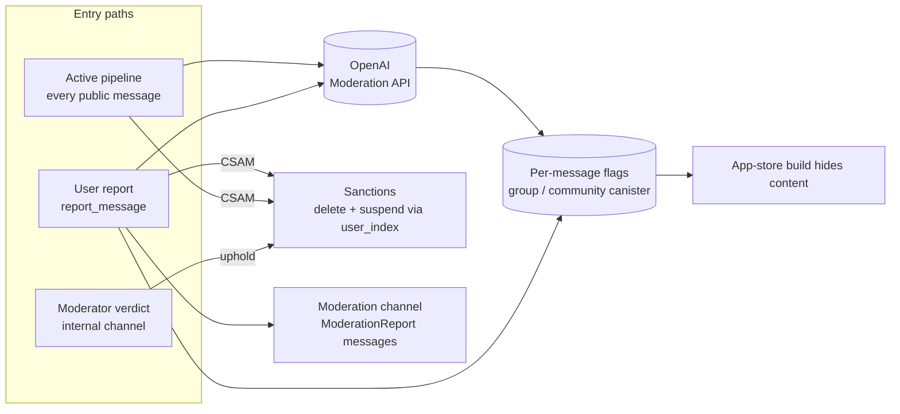
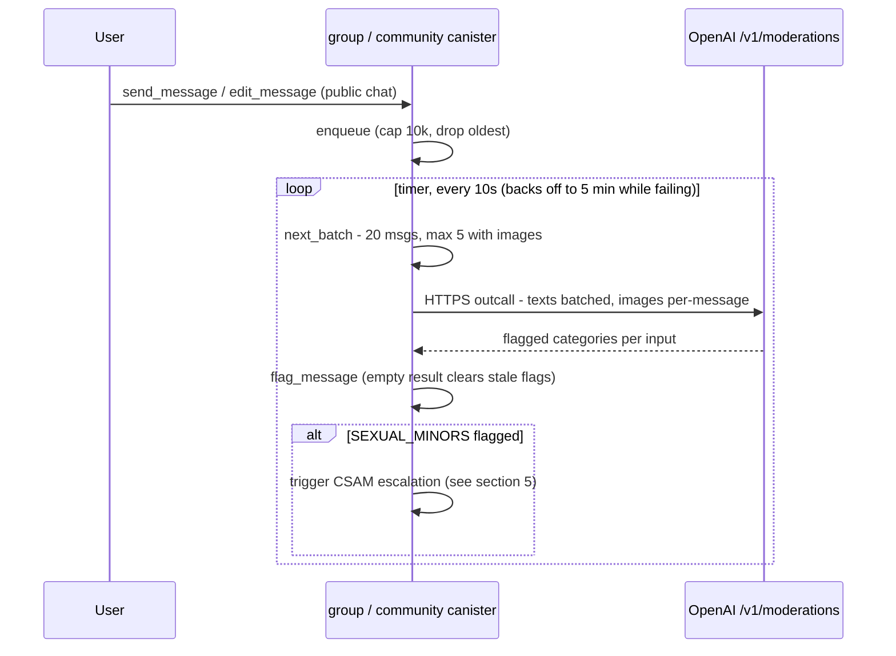
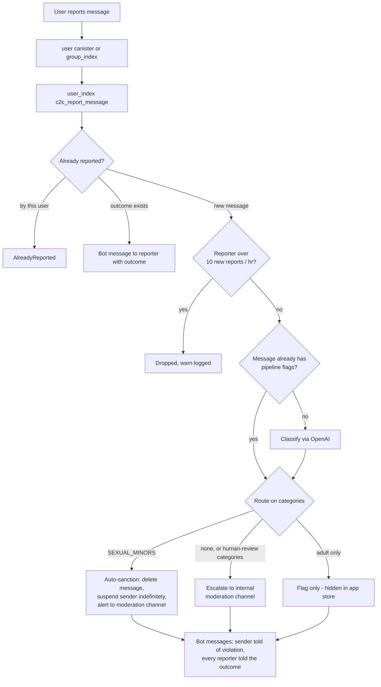
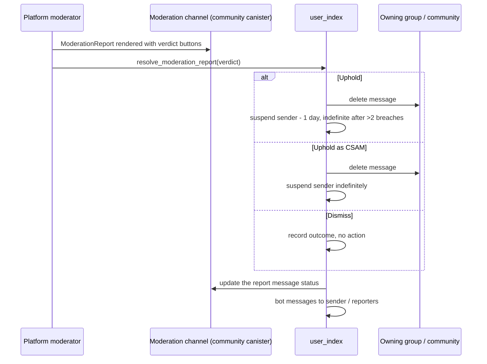

# How the automated moderation system works, end to end

OpenChat classifies content with the OpenAI Moderation API instead of Modclub. Three paths feed
one set of moderation state: an always-on pipeline for public messages, a user-report flow, and
human verdicts in an internal moderation channel. The same state drives content gating in the
app-store builds.

Introduced across PRs [#9088](https://github.com/open-chat-labs/open-chat/pull/9088)–[#9096](https://github.com/open-chat-labs/open-chat/pull/9096). Last updated 2026-07-16.

## 1. The big picture

Every path ends in the same two kinds of state: **per-message moderation flags** stored in the
group/community canister that owns the message, and **sanctions** (message deletion, user
suspension) applied via `user_index`. The app-store frontend build reads the flags to hide
content; the web build shows everything.

| PR | Layer | What it adds |
|----|-------|--------------|
| [#9088](https://github.com/open-chat-labs/open-chat/pull/9088) | BE | Expose community `moderation_flags` in `CommunitySummary` (+ updates), synced group_index → community |
| [#9089](https://github.com/open-chat-labs/open-chat/pull/9089) | BE | Group-level flags in `GroupSummary`, `set_group_moderation_flags`, flag-filtered group search |
| [#9090](https://github.com/open-chat-labs/open-chat/pull/9090) | BE | Per-message flag storage: `ModerationCategories` bitfield + `flag_message()` in chat events |
| [#9091](https://github.com/open-chat-labs/open-chat/pull/9091) | BE | Async pipeline classifying public messages via OpenAI on a timer |
| [#9092](https://github.com/open-chat-labs/open-chat/pull/9092) | BE | OpenAI classification in the report flow; Modclub fully removed; report rate limiting |
| [#9093](https://github.com/open-chat-labs/open-chat/pull/9093) | BE | CSAM escalation routing: group/community → group_index → user_index auto-sanction |
| [#9094](https://github.com/open-chat-labs/open-chat/pull/9094) | FE | App-store builds hide flagged communities, groups and messages |
| [#9095](https://github.com/open-chat-labs/open-chat/pull/9095) | BE/FE | `ModerationReport` message type + moderator verdict UI and endpoint |
| [#9096](https://github.com/open-chat-labs/open-chat/pull/9096) | dev | `OC_DEV_PORT` makes the dev server port configurable |

Merge order: #9090 → #9091 → #9092 → #9093 → #9095 are a stacked chain; #9088, #9089, #9094 and
#9096 sit directly on master.

## 2. Data model — two different "moderation flags"

Don't conflate them — they gate differently in the app-store build:

- **Message flags** — `ModerationCategories`, a `u32` bitfield of eight OpenAI-derived categories
  (bits 0–7), stored on the message inside the owning group/community canister. Every category is
  policy-violating, so the app-store build hides a message when *any* bit is set. An empty
  classification result still calls `flag_message` so stale flags clear when a flagged message is
  edited clean.
- **Group / community flags** — the pre-existing `ModerationFlags` enum (Adult, Offensive,
  UnderReview) set by platform moderators, now exposed on both `CommunitySummary` (#9088) and
  `GroupSummary` (#9089) and usable as a search filter. The app-store build hides a
  community/group only on `Adult | Offensive` — UnderReview must not hide anything.

### OpenAI category → bit mapping

| Category bit | OpenAI categories folded in | Outcome when reported |
|--------------|-----------------------------|-----------------------|
| `SEXUAL` | sexual | **flag only** — hidden in app store, no sanction |
| `SEXUAL_MINORS` | sexual/minors | **auto-sanction** — delete + indefinite suspension |
| `VIOLENCE` | violence | human review |
| `VIOLENCE_GRAPHIC` | violence/graphic | human review |
| `HARASSMENT` | harassment, hate | human review |
| `HARASSMENT_THREATENING` | harassment/threatening, hate/threatening | human review |
| `SELF_HARM` | self-harm, /intent, /instructions | human review |
| `ILLICIT` | illicit, illicit/violent | human review |

Unknown categories returned by OpenAI map to no flags and are logged (`category_to_flag` in
`backend/libraries/group_community_common/src/openai_moderation.rs`).

## 3. Active pipeline (#9091) — every public message gets classified

Sending or editing a message in a *public* group or channel enqueues it for classification. A
10-second timer job drains the queue in batches and writes the resulting flags back onto the
message.

- **API key distribution** — set once on `user_index` via `set_openai_api_key`, broadcast through
  `local_user_index` to every group and community canister as a
  `LocalIndexEvent::OpenAIApiKeyUpdated` event.
- **Outcalls** — `is_replicated: Some(false)`: one request from a single replica instead of ~13,
  no consensus or transform needed. Acceptable because a bad result either hides a message in the
  app-store build or triggers a CSAM sanction that always alerts a human and is reversible. Cycles
  are charged at the replicated rate and the excess refunded.
- **Text vs images** — texts for a whole batch go in one call; each image-bearing message is
  classified separately (text and images in separate calls), so an unreachable blob URL can't
  block text classification. The message result is the union of category bits.
- **Resilience** — queue capped at 10k entries (drop-oldest, logged); 3 attempts per message; the
  job interval backs off exponentially (10s → 5 min) while every call in a batch fails, and resets
  on the first success.

## 4. Report flow (#9092) — user reports reuse the pipeline's judgement

- **One classification per message** — reports are deduplicated on (chat, thread, message index);
  later reporters attach to the existing report and get notified when the outcome lands.
- **Unflagged reports still escalate** — the API can't judge scam/spam, so a clean classification
  goes to human review rather than being dismissed.
- **Rate limit** — 10 not-yet-reported messages per reporter per hour. Excess reports are dropped
  silently (warn in logs); only the flooder's own reports are affected and the messages stay
  reportable by anyone else. Protects against mass-report cost amplification.
- **Modclub is gone** — guards, canister ids, state and the subscription flow are removed; legacy
  Modclub outcomes still deserialize via an untagged `ReportOutcome` enum (covered by a serde
  test).

## 5. CSAM escalation (#9093) — pipeline detections route to the same sanction

When the *pipeline* (not a report) flags `SEXUAL_MINORS`, the owning canister fires
`c2c_csam_detected` → `group_index` (which verifies the caller and derives the chat id) →
`user_index`, which runs the same auto-sanction as the report path: delete the message, suspend
the sender, and post an alert into the moderation channel. The shared logic lives in
`backend/canisters/user_index/impl/src/model/moderation.rs` so the two paths can't drift.

- Message excerpts are truncated to 500 chars, Unicode-safe, before leaving the canister.
- Delivery uses the existing fire-and-forget retry handler (up to 50 attempts, exponential
  backoff).
- The alert is posted for the legal record even if the sanction itself fails.

## 6. Human verdicts (#9095) — the moderation channel is an inbox with buttons

Escalations arrive in the internal moderation channel (configured via
`set_internal_moderation_channel`) as a structured `ModerationReport` message type — message
link, sender, reporters, flagged categories, excerpt, status — instead of plain text. Platform
moderators resolve them in place.

- Verdicts are gated to platform moderators at both `inspect_message` and the endpoint guard;
  double-resolution is blocked.
- Suspension tiers come from the sender's in-breach report count: ≤2 upheld breaches → 1-day
  suspension, more → indefinite.
- The verdict UI exists in both component trees (`components/` and `components_mobile/`);
  "Uphold as CSAM" uses the danger variant on both.

> **Recently fixed — suspension visibility.** Suspending a user never bumped their
> `date_updated`, and the `users_suspended_since` fallback in the `users` query excluded any user
> the caller was already tracking — so clients never saw the suspended flag and cached the stale
> record forever (only an IndexedDB wipe recovered). Fixed in #9092 by bumping `date_updated` on
> suspend/unsuspend; the flag now arrives on the next users poll.

## 7. App-store gating (#9094) — what the store builds hide

`OC_APP_STORE === "true"` is a compile-time flag on the Tauri mobile builds — the gating code is
baked in at build time, so there is nothing for a client to toggle. The web app is unaffected.

| Content | Hidden when | How it shows |
|---------|-------------|--------------|
| Community | `Adult \| Offensive` flag set | Filtered from explore/search (backend + client), navigation blocked, membership placeholder |
| Group | `Adult \| Offensive` flag set | Same as communities; channels inherit their parent community's restriction |
| Message | any `ModerationCategories` bit set | Rendered as an inert restricted placeholder, like a deleted message |

Known, deliberate limits: quoted excerpts, search results and notifications are not yet gated
(called out in the PR).

## 8. Operations — deploying and running it

- **Upgrade order** — deploy group and community canisters before `local_user_index` starts
  broadcasting `OpenAIApiKeyUpdated`. An old receiver traps decoding the new event variant; the
  event batch then retries every 5 minutes and heals itself once the receiver is upgraded, so the
  order is a smoothness concern, not a correctness one.
- **API key** — `set_openai_api_key` on `user_index` (ingress allowed in `inspect_message`); it
  fans out from there. No key ⇒ the pipeline queues stay parked and report classification falls
  back to "no categories" (which still escalates to human review).
- **Frontend cache** — the chats IndexedDB cache version bumps to 149 (#9088) and 150 (#9094);
  both clear the chats store so summaries refetch with the new flag fields. If another PR bumps
  the version, take the next free number — two PRs claiming the same version means the second
  deploy's migration never runs.
- **Costs** — one OpenAI call per text batch (≤20 messages) plus one per image-bearing message;
  report-path calls only for messages the pipeline hasn't already classified. Single-replica
  outcalls keep cycle costs at 1/13th of a replicated call.
- **Observability** — dropped queue entries, rate-limited reporters, unknown OpenAI categories and
  missing users at suspension time are all logged with `warn`/`error`; reporting metrics expose
  message counts and pending outcomes.

**Still open**: PocketIC integration test for the CSAM path is planned once manual verification
completes — it should also cover the third-report-of-same-message case (a pre-existing
lookup-corruption bug in `reported_messages::add_report`, fixed in #9092). Notification and
search-excerpt gating remain future work.
